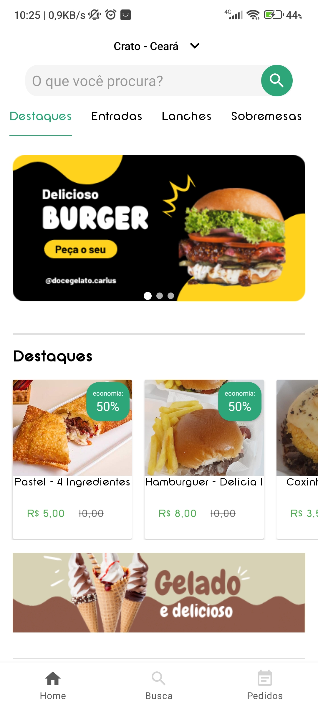
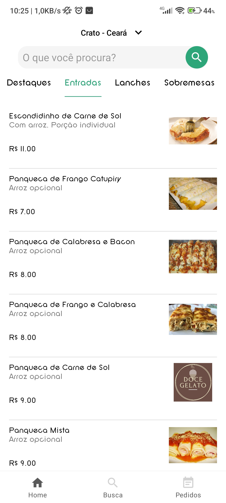
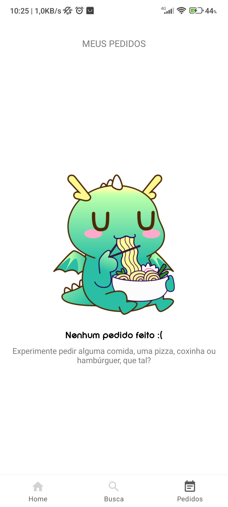
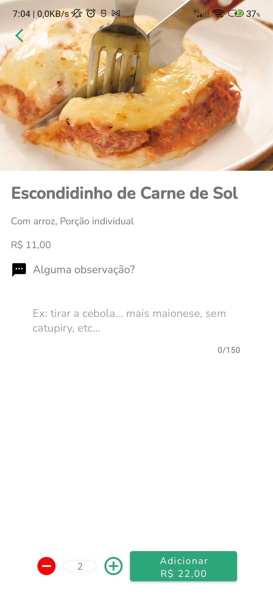
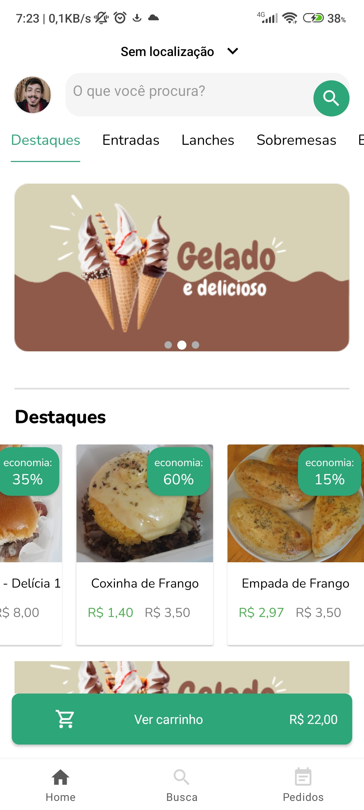
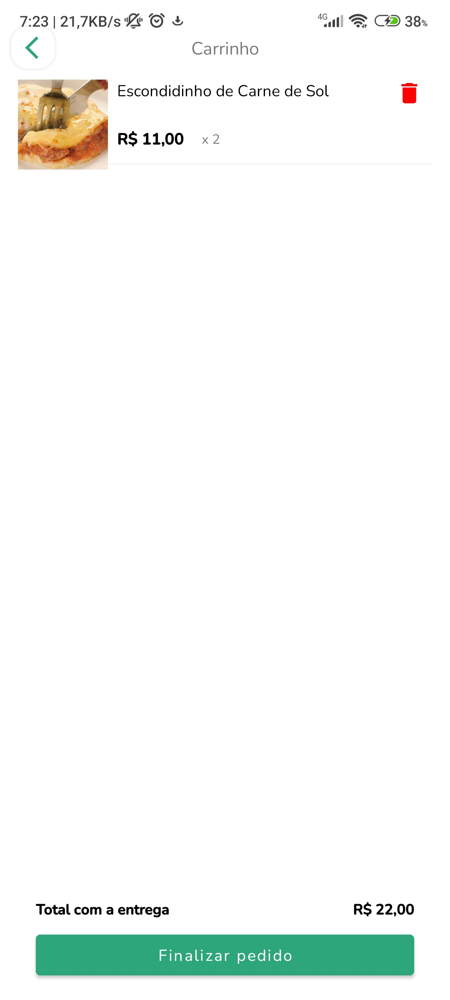

# Doce gelato

## Tema Principal

<p float="left">
  
  
   



</p>

## Detalhamento do projeto
- Brevemente o funcionamento desse aplicativo será reservado e destinado apenas a pessoas localizadas na região de Cariús CE
- Temos um projeto feito em MVVM, dividido em 3 activities, 1 sendo a Main activity, na qual hospeda e faz uso do bototm navigation para sincronizar com os 3 fragmentos principais, a home, a search, e os pedidos... No fragmento home temos outros fragments hospedados, sincronizados com o tablayout, o destaques, e a base fragment (esta ultima é reciclável para todos as demais tabs da home), além disso, temos também na mesma home, fragmentos como o perfil, sacola, e carrinho... é justamente na home que temos o HomeViewModel, o responsável por grande parte da modelagem de dados, ele se comporta como um sharedViewModel, pois seu ciclo de vida está na mainactivity. Voltando aos fragments, temos a search e pedidos (ainda no bottom navigation da main)  e é no pedidos que é feito as requisições ao firestore para pegar os pedidos e informações feitas da conta autenticada. Vale lembrar, que na Login Activity, temos a autentificacao de fato, na verdade ela hospeda 2 fragmentos, o login e o newuserlogin, mas ambos tem funções de cadastro, login, autentificação e informações gerais da conta inicial...Temos uma splash screen destinada em uma activity, temos também varias outras funcões e protótipos que ainda estão sendo ou serão descritos posteriormente.
-Na sacola fragment, todos os pedidos adicionados serão armazenados via livedate, quando estiver tudo pronto, o cliente deve adicionar ao carrinho e finalizar o pedido, este será enviado diretamente ao firestore onde será guardado e verificado junto a sua conta... Todos os pedidos e detalhes serão enviados ao admin pelo mesmo aplicativo na aba de perfil, onde será aberto uma nova opção somente ao administrador com os pedidos feitos por todos os usuários.


## Tecnologias


#### Linguagens:

- Kotlin 
- Java
- Xml

#### Arquitetura usada:
- MVVM (ViewModel e LiveData)

#### Libraries:
- Retrofit 2.9.0
- Gson 2.3.0
- Picasso 2.8
- Slide View 0.1.0 
- Live Data 2.5.0
- ViewModel 2.5.0

## Setup

Para rodar esse projeto, instale-o baixando ou clonando o repositório.

#### Requisitos do sistema 

- Ter um computador
- Android Studio Chipmunk | 2021.2.1
- Minimum sdk v21
- Compile sdk v32

## Licença

```html
MIT Licence 

Copyright (c) 2022 Wanderley Filho

Permission is hereby granted, free of charge, to any person obtaining a copy of this software
and associated documentation files (the "Software"), to deal in the Software without restriction,
including without limitation the rights to use, copy, modify, merge, publish, distribute, sublicense,
and/or sell copies of the Software, and to permit persons to whom the Software is furnished to do so, 
subject to the following conditions:

The above copyright notice and this permission notice shall be included in all copies or substantial 
portions of the Software.

THE SOFTWARE IS PROVIDED "AS IS", WITHOUT WARRANTY OF ANY KIND, EXPRESS OR IMPLIED, 
INCLUDING BUT NOT LIMITED TO THE WARRANTIES OF MERCHANTABILITY, FITNESS FOR A PARTICULAR PURPOSE
AND NONINFRINGEMENT.IN NO EVENT SHALL THE AUTHORS OR COPYRIGHT HOLDERS BE LIABLE FOR ANY CLAIM,
DAMAGES OR OTHER LIABILITY, WHETHER IN AN ACTION OF CONTRACT,
TORT OR OTHERWISE, ARISING FROM, OUT OF OR IN CONNECTION WITH THE SOFTWARE
OR THE USE OR OTHER DEALINGS IN THE SOFTWARE.
```
